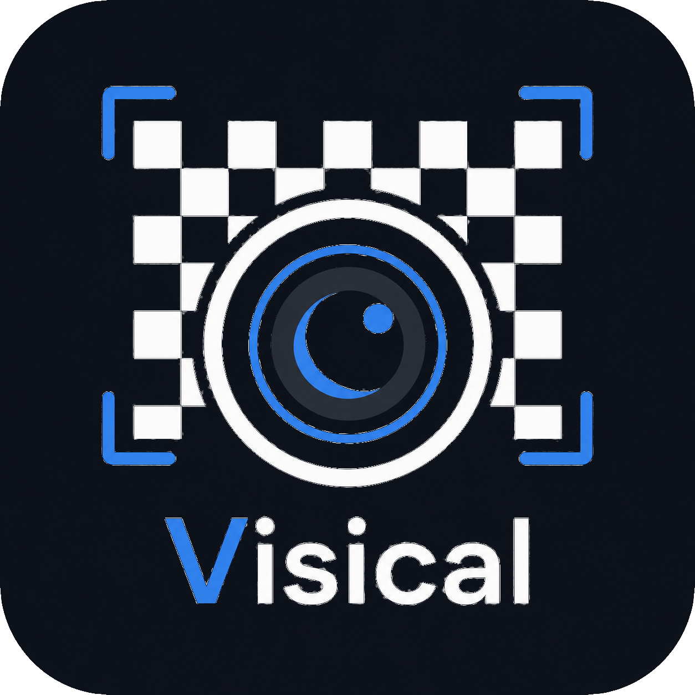
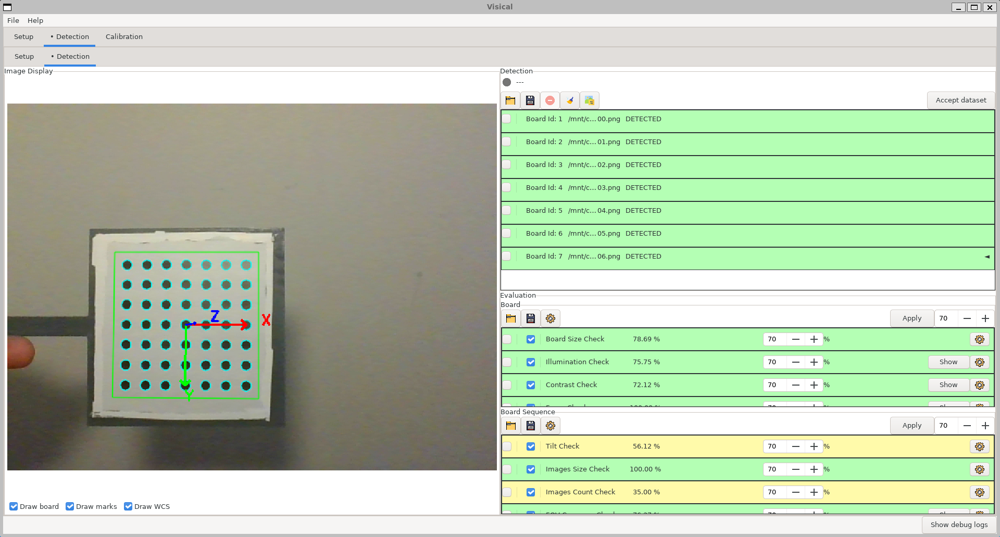
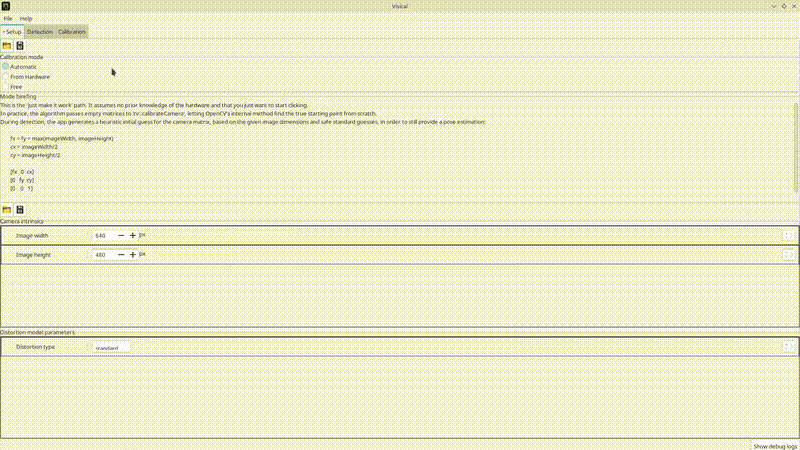
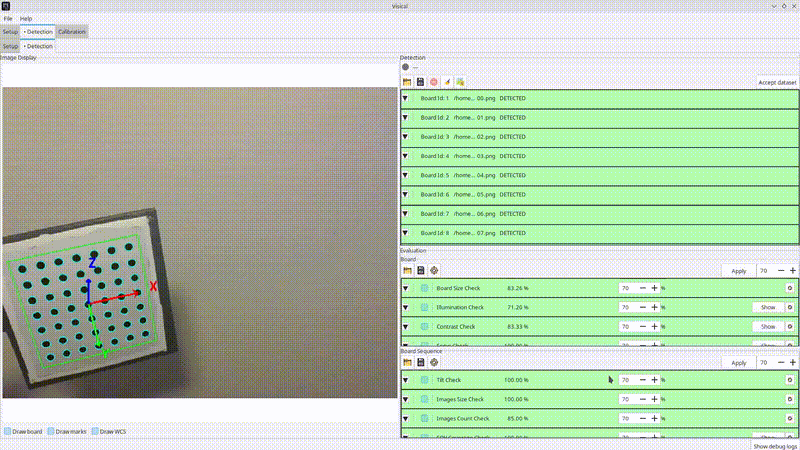
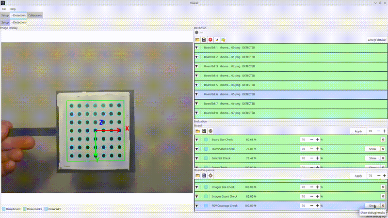
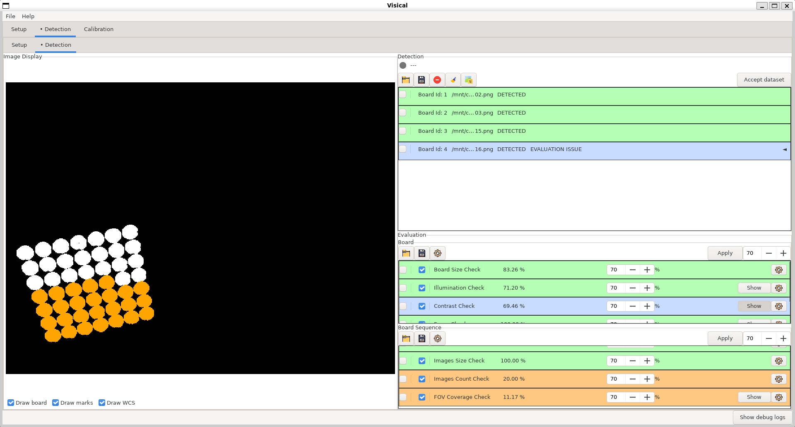
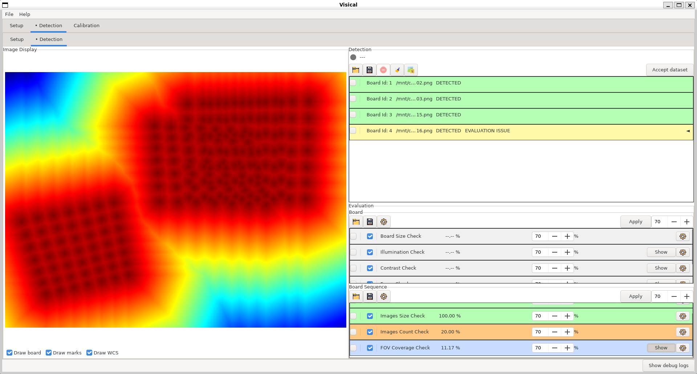

<p align="center">
  
</p>

**A cross-platform C++ application for camera calibration with modular quality evaluation and multi-source image acquisition.**

---

[Introduction](#introduction) • [Features](#features) • [Installation](#installation) • [Quick Start](#quick-start) • [Architecture](#architecture) • [License](#license)


# Introduction

Visical is a cross-platform camera calibration tool built with [OpenCV](https://opencv.org/) and [wxWidgets](https://www.wxwidgets.org/). It combines a OpenCV-driven calibration pipeline with a non-blocking evaluation framework, where calibration can proceed even if individual evaluations fail. In this design, OpenCV remains the authoritative source of the process, while evaluation acts as an independent, quality-assessment layer.

<p align="center">
  
</p>

## Features

- **Multi-source acquisition** - load images from disk, capture from webcams, or connect to GigE/USB3 Vision cameras via [Aravis](https://github.com/AravisProject/aravis).
- **Full calibration pipeline** - OpenCV-driven board detection, pose estimation, and camera optimization in a single workflow.
  - Supports single-camera calibration. Stereo and multi-camera setups are currently out of scope.
  - Supports **chessboard, circles grid, ChArUco**, and **AprilTag** patterns.
- **Modular evaluation framework** - independent quality plugins assess boards and calibration results.
Plugins are independently enabled, disabled, configured, and persisted as JSON; covers individual boards, board sequence, and final calibration metrics
- **Cross-platform** - runs on Linux and Windows, built with C++23, CMake, and vcpkg

# Installation

## Quick Installation (Recommended)

Prebuilt binaries are available for supported platforms through the GitHub Releases page.

1. Open the repository's [**Releases**](https://github.com/BrugolaOvoidale/Visical/releases) page.
2. Download the latest package for your platform.
3. Extract the archive.
4. Launch Visical.

No compilation or dependency installation is required.

<details>
<summary><strong>Build from Source (Advanced)</strong></summary>

This project uses CMake as its build system, with configuration managed through CMakePresets.json. Dependencies are handled via vcpkg, defined in vcpkg.json.

The project is primarily developed and tested with Clang, but other C++ compilers may work with minimal adjustments.

---

### Prerequisites

Before building, ensure you have the following installed:

- CMake (≥ 3.20 recommended)  
- Clang (or another C++23-compatible compiler)  
- Git  
- vcpkg  

---

### Setup vcpkg

If vcpkg is not already installed:

```bash
git clone https://github.com/microsoft/vcpkg.git
cd vcpkg
./bootstrap-vcpkg.sh   # Linux
.bootstrap-vcpkg.bat   # Windows
```

Make sure that environment variable `VCPKG_ROOT` is correctly set.

---

### Clone the Repository

```bash
git clone https://github.com/BrugolaOvoidale/Visical.git
cd Visical
```

---

### Install Dependencies

Dependencies are automatically resolved via vcpkg.json during CMake configuration.

---

### Configure & Build

Using CMake presets (recommended):

```bash
cmake --preset <preset-name>
cmake --build --preset <preset-name>
```

To list available presets:

```bash
cmake --list-presets
```

Alternatively, you can configure manually:

```bash
cmake -S . -B build -DCMAKE_TOOLCHAIN_FILE=<path-to-vcpkg>/scripts/buildsystems/vcpkg.cmake
cmake --build build
```

---

### Notes

On Linux, vcpkg may not be able to install all third-party dependencies automatically. If this happens, install the missing dependencies manually. Check the CMake configuration output for details.

</details>

---

# Quick Start

Before starting, make sure your calibration board is properly printed and mounted.
Refer to the official OpenCV guide: [**Create Calibration Pattern**](https://docs.opencv.org/4.x/da/d0d/tutorial_camera_calibration_pattern.html).
Mount it rigidly on a flat surface before acquisition.

- **Configure** - on the Setup page, set the image size in pixels ("Camera intrinsics" box). Then navigate to the Detection page → Setup sub-page, choose the image source, and set the board parameters ("Detection parameters" box).
- **Detect** - navigate to the Detection sub-page and load images using the folder icon. The app will display images on the left and detection and evaluation results on the right.

<p align="center">
  
</p>

  - **Evaluate** - quality assessments per board and per sequence are also displayed.

<p align="center">
  
</p>

- **Calibrate** - once satisfied with the dataset, click "Accept dataset": Visical will automatically move to the Calibration page, run the calibration, and return the camera parameters, evaluation results, and the option to see the images undistorted.

<p align="center">
  
</p>

- **Save** - export the calibration result to a JSON file using the save button on the left.

Example of a calibration result in a JSON file:

```json
{
    "camera": {
        "focal_length_x": 3778.998517383195,
        "focal_length_y": 3795.4120564419795,
        "principal_point_x": 550.0582420918876,
        "principal_point_y": 648.8049607977425
    },
    "distortion_model": {
        "standard": {
            "k1": -0.39599703363377464,
            "k2": 1.044774916481398,
            "p1": 0.0007796825585351178,
            "p2": 0.0009423617956795151,
            "k3": -9.679592041202422
        }
    },
    "cameraModel": {
        "reprojectionError": 0.14116148019896574
    }
}
```

---

# Architecture 

Visical is organized into four layers:
- **Acquisition**: where images are loaded or grabbed, ready to be analyzed by the board detector.
- **Detection**: where OpenCV will try to find board on images and estimate their pose.
- **Calibration**: where OpenCV will optimize the camera using detected boards.
- **Evaluation**: runs along both Detection and Calibration layers, evaluating quality of detected boards and calibration results. It behaves as a non-authoritative guide, giving only advice to get a good calibration, but does not block it, even if evaluations fails.

<p align="center">
  
</p>

## Acquisition Layer
Visical supports two image acquisition modes:

- **Disk loading** - import existing images from the filesystem for offline calibration workflows.
- **Live camera capture** - acquire images directly from hardware:
  - **GenICam-compliant cameras** via Aravis.
  - **Webcams** via OpenCV's `VideoCapture` interface.

## Detection Layer
During detection, OpenCV will try to find a board on image and estimate its pose. The Visical system will store all detection result (found or not), to allow re-detection or re-evaluation.

## Calibration Layer
After collecting a dataset of boards, Visical will run calibration using only detected board. This is the only constraint by OpenCV, boards with failed evaluation are still used.

## Evaluation Framework
Quality evaluation is organized around a set of modular, composable plugins that can assess:

- **Single detected board** - evaluates the geometric quality of an individual detected calibration board.
- **Detected board sequence** - assesses the collected board set as a whole.
- **Single calibrated board** - inspects each board's contribution to the final calibration result.
- **Calibration result** - evaluates the calibration outcome through reprojection errors and related metrics.

Each plugin is independent and can be enabled, disabled, configured and saved in JSON files.
The evaluation system is intentionally decoupled from the calibration pipeline, in order to keep OpenCV as the only authoritative source of the calibration process.

### Examples
The **Constrast check** calculates contrast metrics to ensure that markers are sufficiently distinguishable from the background.

<p align="center">
  
</p>

The **FOV Coverage check** analyzes the board sequence to determine if the detected points sufficiently cover the Field of View (FOV).

<p align="center">
  
</p>

---

# Contributing

Feedback and bug reports are very welcome.

## Reporting Issues

If you encounter a bug or unexpected behavior, please open an issue and include:

- A clear description of the problem
- Steps to reproduce it
- Your platform (Linux / Windows) and compiler version
- Any relevant error output or screenshots

## Pull Requests

If you'd like to contribute code, please **open an issue first** to discuss the change.
This avoids wasted effort on PRs that may not align with the project's direction.

---

# Limitations & Roadmap

Visical is actively developed but currently scoped to a specific set of use cases.
The following lists what is not yet supported and what may be addressed in the future.

## Current Limitations

- **Single-camera only** - stereo and multi-camera calibration setups are not supported.
  Each calibration session produces intrinsics for one camera.

## Possible Future Directions

These are not commitments, just honest candidates for future work based on
current gaps:

- **Stereo calibration** - extending the pipeline to support camera pairs and
  extrinsic estimation between them.

Contributions addressing any of the above are welcome. See [Contributing](#contributing).

---

# License

This project is licensed under the [Apache License 2.0](https://www.apache.org/licenses/LICENSE-2.0).

You may use, distribute, and modify this software under the terms of the Apache 2.0 license. See the [LICENSE](LICENSE) file for the full license text.
